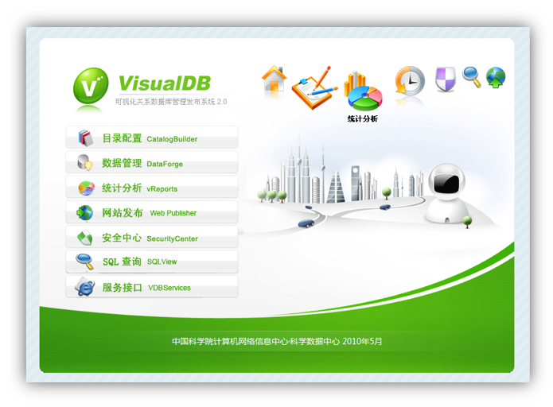
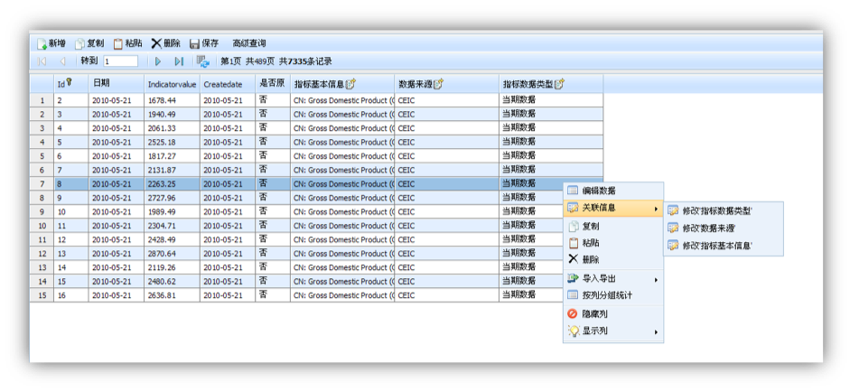
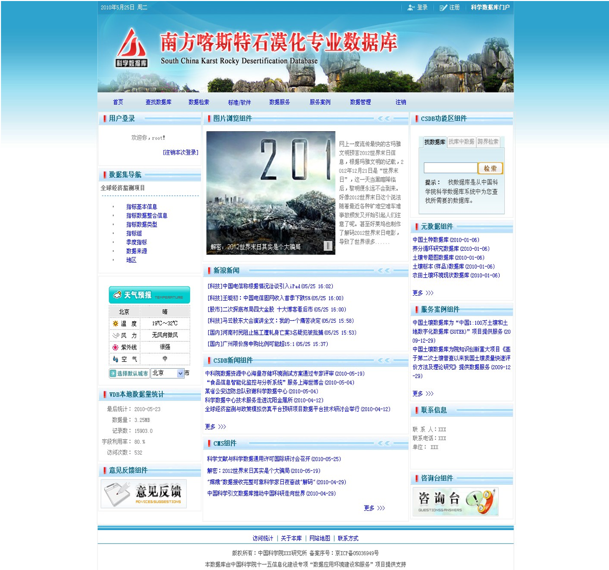

# vdb-2.0
a web-based dbms management &amp; publishing tool

# 在IDEA中调试VDB

* 打开IntelliJ IDEA 15
* Check out from version control\Git
* 输入本项目的github地址
* 项目打开后，Debug窗口新建一个Tomcat Server项
* deployment项选择vdb artifact
* 启动调试即可

# 生成war

* 在IDEA中打开VDB项目之后，执行build，即可生成war文件
